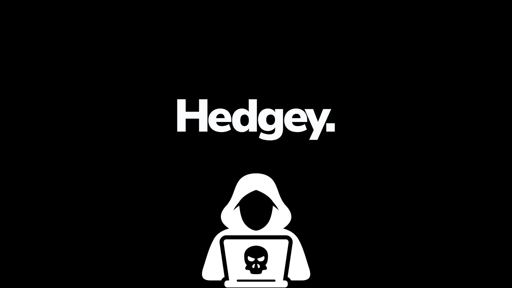
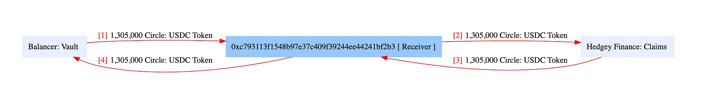
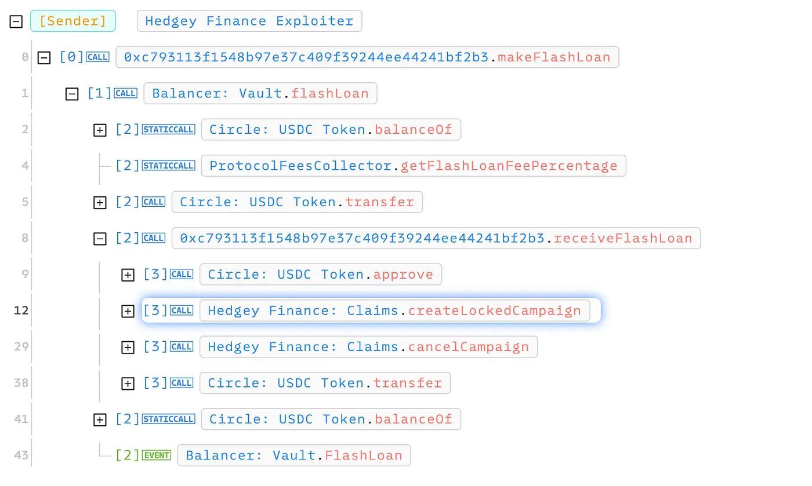
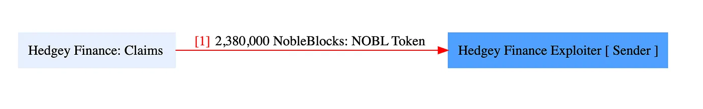
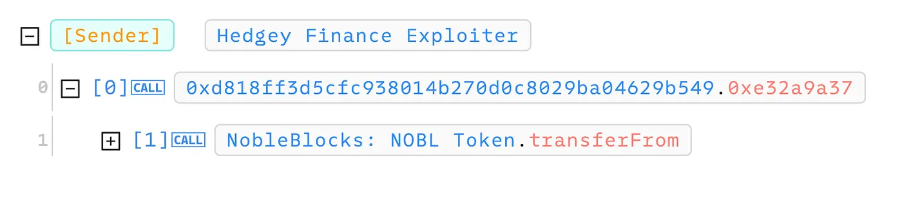
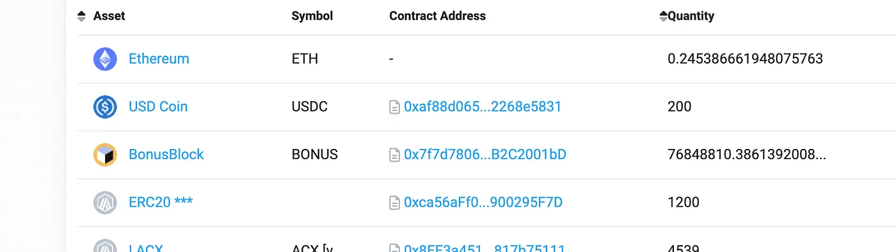
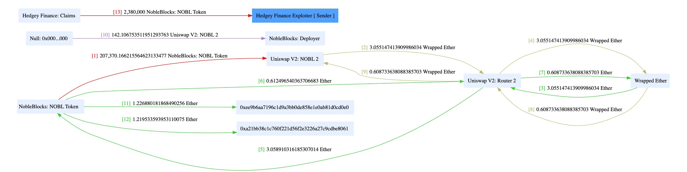
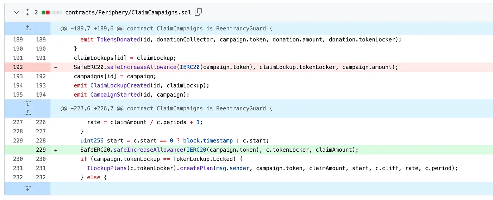

[Reference](https://medium.com/@satyvm/analysis-of-the-hedgey-finance-exploit-a93880102aa7)

by [Satyam](https://medium.com/?source=post_page---byline--a93880102aa7---------------------------------------)

## Resulting in a loss of $44.7 million worth of assets

On April 19th of this year, Hedgey Finance fell victim to a standard flash loan attack by hackers who stole $2.1 million on the Ethereum Mainnet and $42.6 million worth of assets on the Arbitrum network, resulting in approximately $44.7 million lost funds.

Cyvers first reported the exploit, and [Hedgey Finance confirmed](https://x.com/hedgeyfinance/status/1781257581488418862) it a few hours later.

But what does Hedgey finance do?

### Background

Hedgey Finance provides a free platform for creating and managing on-chain token vesting, lockups, claim portals, and associated functionalities. It claimed to be "the #1 token vesting and lockup tool," to this day, it does the same even after the exploit. It's so ironic. They will need a lot of work to regain that trust.

## Vulnerability Analysis & Impact

### On-Chain Details

[Attacker Address](https://etherscan.io/address/0xDed2b1a426E1b7d415A40Bcad44e98F47181dda2): `0xDed2b1a426E1b7d415A40Bcad44e98F47181dda2`

[Attack Contract](https://etherscan.io/address/0xC793113F1548B97E37c409f39244EE44241bF2b3): `0xC793113F1548B97E37c409f39244EE44241bF2b3`

[Vulnerable Contract](https://etherscan.io/address/0xBc452fdC8F851d7c5B72e1Fe74DFB63bb793D511): `0xBc452fdC8F851d7c5B72e1Fe74DFB63bb793D511`

[Main Attack Transactions](https://etherscan.io/tx/0x2606d459a50ca4920722a111745c2eeced1d8a01ff25ee762e22d5d4b1595739): `0x2606d459a50ca4920722a111745c2eeced1d8a01ff25ee762e22d5d4b1595739`

### Root Cause

The root cause of the hack was the lack of input validation on the user's parameter within a critical function inside the token-locking contracts, which helped the attacker gain access to unauthorized tokens. This token approval vulnerability was created in the `ClaimCampaigns` Contract (in the _line 192_).

## [Locked_VestingTokenPlans/contracts/Periphery/ClaimCampaigns.sol at…

### Contribute to hedgey-finance/Locked_VestingTokenPlans development by creating an account on GitHub.

github.com](https://github.com/hedgey-finance/Locked_VestingTokenPlans/blob/8c7679c7526c29980c6255127c0cd0ba85d000fa/contracts/Periphery/ClaimCampaigns.sol?source=post_page-----a93880102aa7---------------------------------------)

The attacker started by taking a flash loan and created a new campaign using the `createLockedCampaign()` Function. The creation of tokenLocker granted the exploiter's contract approval to interact with the token vested under the Hedgey's contract. In the same transaction, the `cancelCampaign()` function withdraws tokens from the tokenLocker, but it fails to revoke the granted token allowance, although it revoked the claim approval. With the approval still there, the attacker can transfer other unauthorized tokens.

## **The Attack**

### **Transaction 1: Preparation**

1.  The attacker receives _$1.3M USDC_ in flash loan from **Balancer** for the exploit contract.
2.  Attacker creates campaign with locking $1.3M USDC via the `createLockedCampaign()` function.
3.  Attacker cancels campaign via the `cancelCampaign()` function, exploit contract receives the locked _$1.3M USDC_ back and returns it to the Balancer.

### Transaction 2: Draining Funds

1.  The `cancelCampaign()` function does give back the funds but doesn't revoke the allowance for using `transferFrom` on the USDC token contract.
2.  The attacker used this door to drain _$1.3M USDC_ from the **ClaimCampaigns** contract using `transferFrom` on the USDC token contract.
3.  In addition to USDC, a large number of NOBL Tokens were stolen from the **ClaimCampaigns** contract valued at _$0.8M_ at that time. Also, adding to it, _$20K_ MASA tokens were stolen.

4. The attacker also utilized the **Arbitrum network** to exploit the same vulnerability to abscond with more than 77.74M BONUS tokens valued at around _$42M_ at the time of the exploit. On Arbitrum,

[Exploiter's address](https://arbiscan.io/address/0xc7241e27ee4b8d32b59a10e848b48530047a8c5b): `0xc7241e27ee4b8d32b59a10e848b48530047a8c5b`

[Attack Contract](https://arbiscan.io/address/0xbb52f1723ddf2c84ba2668f4e04712f572cbf780): `0xbb52f1723ddf2c84ba2668f4e04712f572cbf780`

[Exploited Contract](https://arbiscan.io/address/0xbc452fdc8f851d7c5b72e1fe74dfb63bb793d511): `0xbc452fdc8f851d7c5b72e1fe74dfb63bb793d511`

### Total Loss

Since the liquid backing of the token is essential to determine the actual value of the tokens stolen, the real loss is much less than the loss reported by multiple reports. The attacker's wallet still has a [balance](https://arbiscan.io/tokenholdings?a=0xc7241e27ee4b8d32b59a10e848b48530047a8c5b) of 76.8M BONUS tokens. A further 200k tokens were transferred to a Bybit account, and ~900k tokens remain in additional wallets. So, the total loss is around $600K on Arbitrum and $2.1M on Ethereum, totaling $2.7M.

### The flow of Funds

Too complex to explain, I know, and that too in writing. Very difficult. Hopefully, you will understand what took place from the above flow diagram.

## Aftermath

Following the hack, the Hedgey team went on X to inform its users about the hack and advise users to cancel their active claims to mitigate any additional impact. Hopefully, it mitigated some potential loss.

### Lessons Learned

A reminder of the importance of robust security measures in decentralized finance (DeFi) protocols.

- Input validation and parameter verification are fundamental safeguards against exploitation.
- Auditing is essential and helps remove vulnerabilities pre-hack.
- This incident also highlights the limitations of audits and the importance of real-time transaction security measures. As mentioned before, the detection by Cyvers.
- Business logic maintenance is crucial in any project's development and design process.
- The flaw was solved as quickly as adding and deleting a line of code.

_These crypto exploits are a constant reminder of the importance of security in this field. This line of code cost Hedgey around $3M, which is expensive. The question remains: can Hedgey reclaim the trust it has lost?_

I hope you like it. For more such content, _follow me on_ [\_M_edium](https://medium.com/) _or_ [_X_](https://x.com/satyvm)_._

Till then, adiós!

_Thank you for reading._
