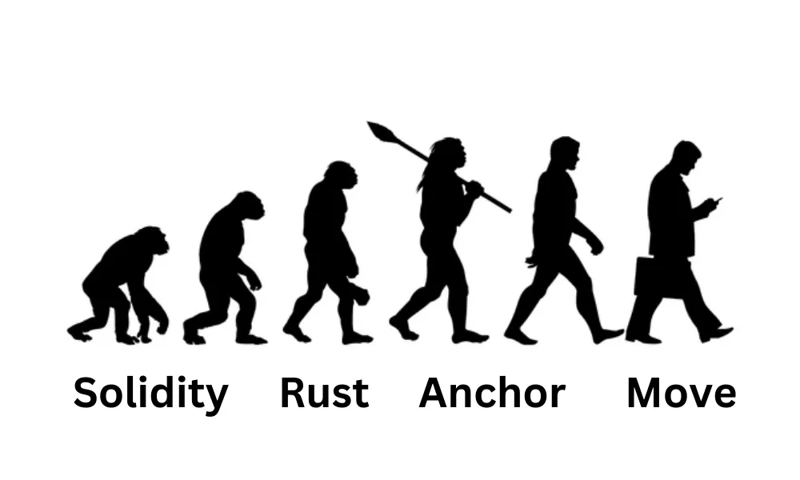
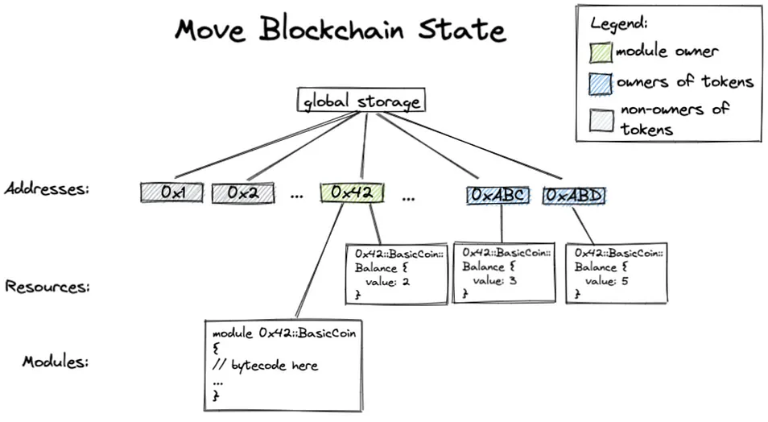
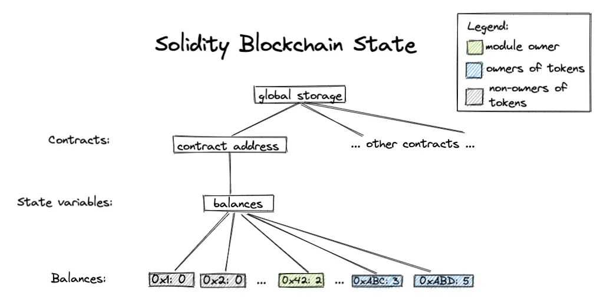
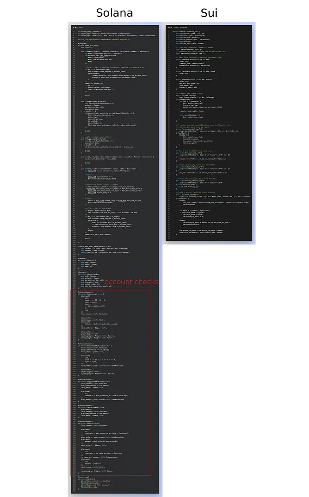
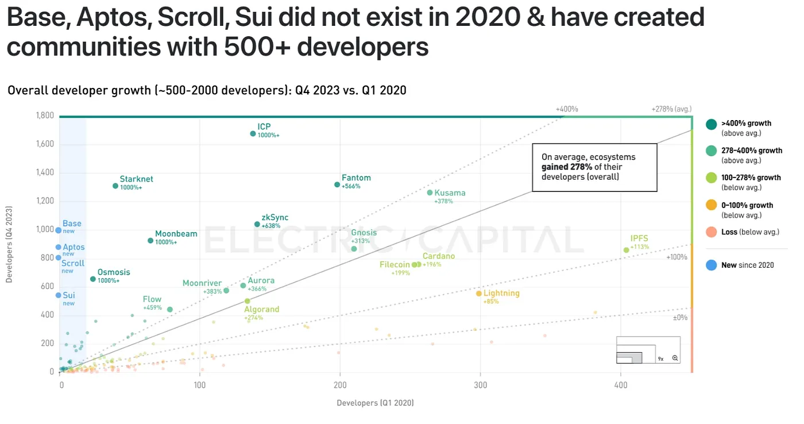
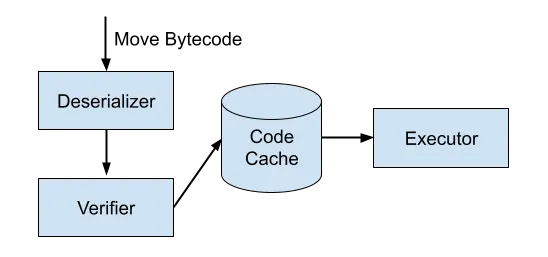
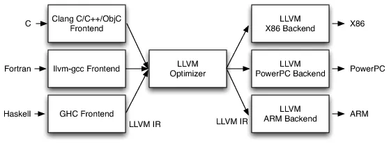
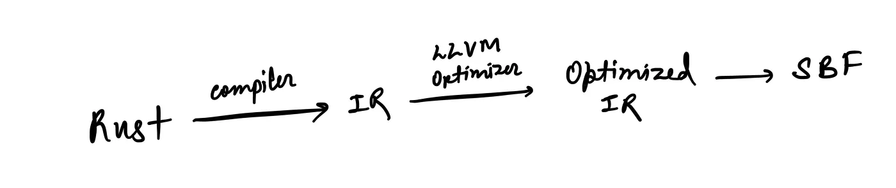
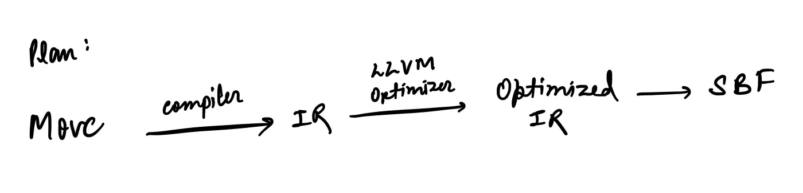

## A Smart Contract Language on the rise

“Move,” a language that has been rising recently with the development of emerging blockchains like Aptos and Sui. Now, we can watch the steady development in Solana.

> Move programming language is a safe and flexible language built for the blockchain giving you power for programable resources.

Let’s begin by deep-diving into Move to understand it better,

## Why Move?

It was originally built by Facebook’s Libra/Diem Blockchain — a payment network. The language came into existence with the native support for ownership/assets which other languages were lacking. The design of Move defines custom resource types forcing a resource can’t be copied or implicitly discarded, only moved between program storage locations. Basically, the safety is implemented by Move’s type system.

In layman's terms, Move is statically typed and designed around modules giving it a fundamental advantage compared to other languages.



Move was designed while keeping four key goals in mind: first-class resources(assets), flexibility, safety, and verifiability.

**First-class resources:** Let users write programs that directly interact with the digital assets while using the type system guaranteeing safety.

**Flexibility:** Move adds flexibility via transaction scripts. A transaction script is a single procedure that contains an arbitrary Move code, which allows customizable transactions.

**Safety:** Move rejects any program that does not satisfy key properties, such as resource safety, type safety, and memory safety. It is ensured by the on-chain bytecode verifier and after verification, it is directly executed by the bytecode interpreter.

**Verifiability:** Security and computational cost go hand in hand, we have to carefully weigh both. Move balances the two by using lightweight on-chain verification and advanced off-chain static verification tools.



_The key difference is Solidity’s storage is address-based whereas Move’s storage is object-based._

### But how it is different from Solana?

I assume you have familiarity with Solana’s Programming model or else you can give a read to [this](https://humont.dev/notes/2021-09-01-solana-programming-overview).

The biggest difference is that **Move doesn’t require account checks**. Which is very tricky to implement on Solana and also a reason for some biggest exploits ([account substitution attacks](https://rekt.news/wormhole-rekt/)). Solana has to run checks such as account ownership, type, instance, and signature checks.

So how Move is handling this? In the Move runtime, some of the checks are transparently run and the rest of them are verified statically at the compile time. Even the type system design allows Move to skip some of the checks often required in Solana.

For example, due to checks and other declarations, the “Mint Authority” code in Solana and Move (Sui) has a distinct gap in size.



Apart from the checks, Solana stores the addresses of other accounts in the form of pointers and doesn’t store the actual data. To access the accounts, they need to be passed every time and manually checked. On the other hand, in Move, we can directly access them using structs indefinitely without running any checks.

This is the reason, “_Move becomes a lot safer and faster option to code due to its global typed system and natural design._”

An example of Move from [the Move book](https://move-language.github.io/move/):

```
module 0x42::test {
    struct Example has copy, drop { i: u64 }

    use std::debug;
    friend 0x42::another_test;

    const ONE: u64 = 1;

    public fun print(x: u64) {
        let sum = x + ONE;
        let example = Example { i: sum };
        debug::print(&sum)
    }
}
```

If you want to explore coding in Move you can check out [this curated list.](https://github.com/MystenLabs/awesome-move) Also, [this Move tutorial](https://github.com/move-language/move/blob/main/language/documentation/tutorial/README.md) is a good place to get started.

::github{repo="MystenLabs/awesome-move"}
::github{repo="move-language/move"}

All this was a technical overview of the “Why Move?”. But do we have a community of developers who are interested in this?

### Move community


Even Aptos and Sui (Move-based blockchains) are fairly new blockchains, they have a much greater number of developers compared to blockchains Algorand and Stacks who use their programming languages.



To make this read more interesting I figured why not get to know the behind-the-scenes of the project Move on Solana. It’s a good way to give your brain a headache, at least to mine, lol.

## Move on Solana

Before getting into all the heavy stuff, knowing how Move works is convenient to understand.

### How Move Works?

Move is built on Rust with ownership in mind and is strongly focused on simplicity, correctness, and verifiability. It doesn’t support dynamic dispatch which makes it faster, efficient, and allows early detection of type errors.

First, the Move code is compiled into Move bytecode, which runs in the Move VM for the Bytecode validation. The traditional architecture of the Move virtual machine:



**There are three ways we can get Move on Solana:**

1.  **Compile Move to SBF (like Solang):** To implement this we might have to skip the Move Bytecode verification part, making it useless as we are not able to utilize all the advantages attached to Move.
2.  **Add the Move VM as a native loader (alongside the SBF VM):** This is a nice intuitive idea, but maintaining two different loaders in the runtime is not ideal for security (as it increases the attack surface by twice).
3.  **Run the Move VM as a program:** Out of all the options, this becomes inevitably the most reliable way to implement Move as it has already been carried out for running EVM on Solana (Neon).

To approach the implementation of running the Move VM as a program, we would need to create a Move-LLVM compiler, this will become clear as we proceed forward in the article.

### LLVM Backend for Move

So, LLVM? LLVM (Low-Level Virtual Machine) is a set of compilers and toolchains, used to create the front end of any programming language or backed for any instruction set architecture.



I know, LLVM can be intimidating to code. So why even try to do it? Because Solana runtime uses it.

First, The compiler breaks down the rust source code into lexemes, and then it verifies the correctness and validates the logic. In the second stage, the compiler generates the intermediate representation (IR) code. Now, the _LLVM optimizer_ comes into play, which complies IR into optimized IR code (LLVM bytecode). In the end, the optimized IR code is translated into Solana Binary Format (SBF, a Solanaized eBPF).



It makes sense to replace the Rust source code with the Move source code and generate IR code.



In Rust, we have a few options to interface to LLVM:

- [llvm-sys](https://docs.rs/llvm-sys/latest/llvm_sys/) — raw unsafe bindings to the LLVM C API
- [inkwell](https://thedan64.github.io/inkwell/inkwell/index.html) — idiomatic Rust bindings to `llvm-sys`
- [llvm-ir](https://docs.rs/llvm-ir/latest/llvm_ir/) — another high-level Rust binding

**“llvm-sys”, llvm’s Rust C bindings stands out as the best option and it was used to develop the current** [**Move-LLVM backend**](https://github.com/anza-xyz/move/tree/llvm-sys/language/tools/move-mv-llvm-compiler)**.**

::github{repo="anza-xyz/move"}

### Challenges of Porting Move

The Move language and the Move VM are tightly integrated. The Move bytecode must be validated on the Move VM before running as any other platform that doesn’t interpret the bytecode will lack the security and guarantee that comes with Move.

As all blockchains have a strong process boundary between any two programs, it’s very hard to see Move coming into the picture with SBF. This causes a barrier to run Move on Solana. Meaning that just converting the Move source code to IR is not enough. _Even after compiling it to LLVM, the Move code doesn’t have access to services provided by Move VM_.

The Move VM is a stack machine, and LLVM is a register machine, so how to translate one to the other is not immediately obvious. This could have become a technical challenge but we have, _Move Stackless Bytecode._ Move stackless bytecode is a transformation of the Move bytecode to a register machine model while utilizing the Move theorem prover.

Another technical problem that arises is how to deal with **missing LLVM APIs**. While LLVM C APIs have almost every feature, usually, developer needs to add their little library to expose the C++ APIs.

## Future?

Now you might all agree that Move is an amazing piece of technology. And I believe having Move on Solana in the long run is worth it.

There will be more problems to be solved as the project moves forward. But when the project Move is concluded, I will be back with “Coding Move on Solana”.
