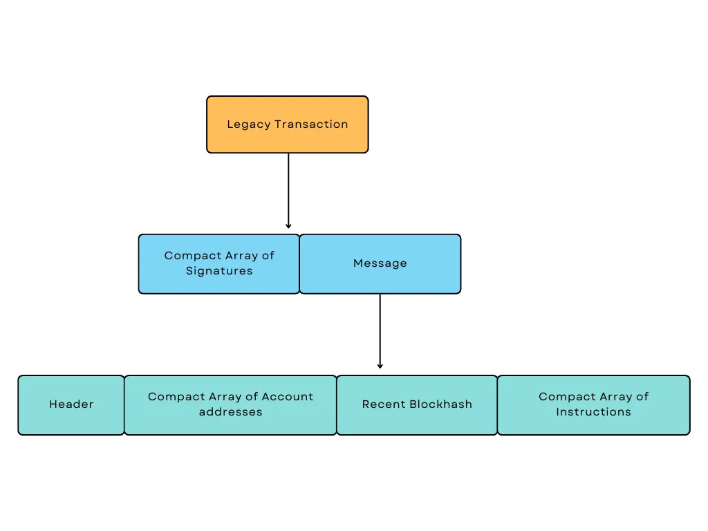
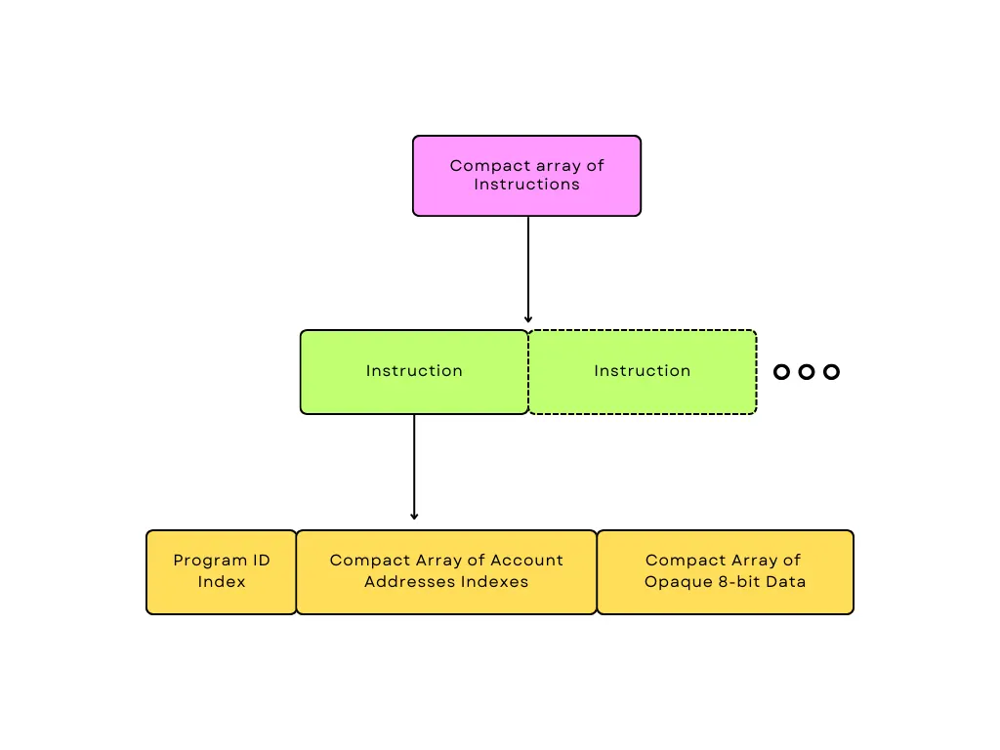
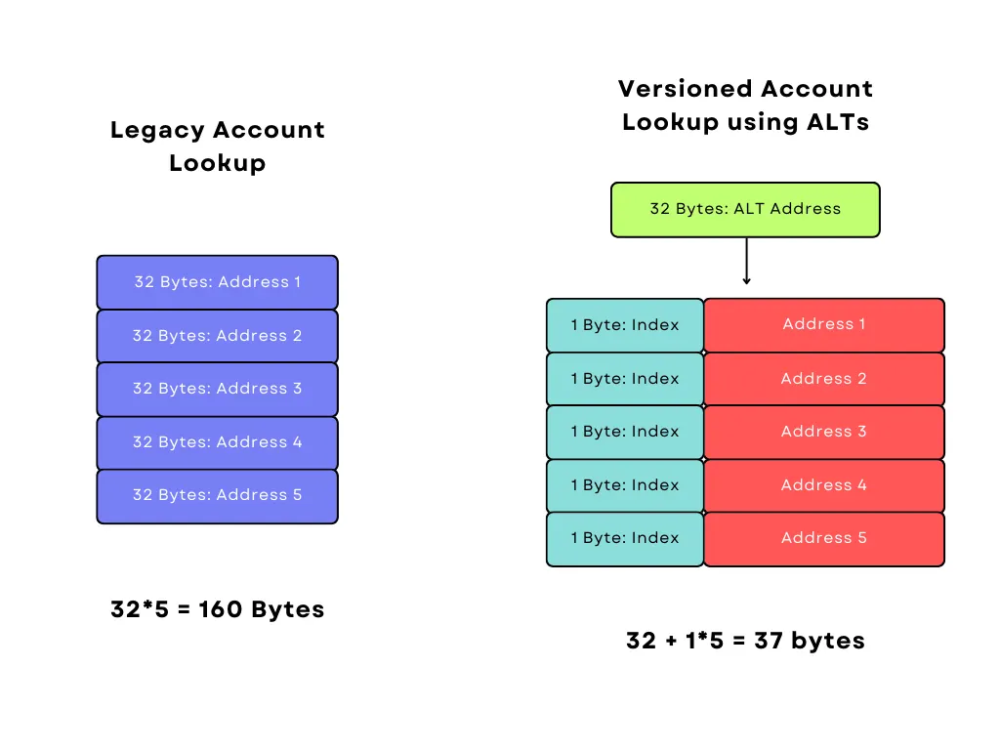
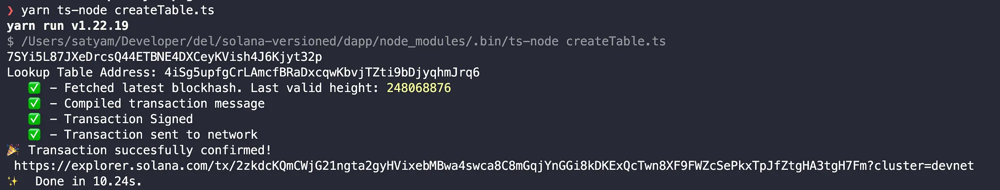
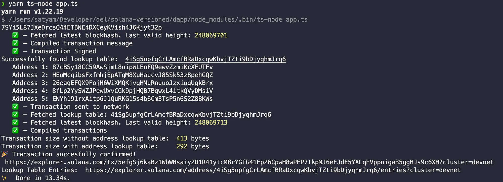

## Looking into the new lookup table

Solana is fast; I mean, it allows hyper-parallelized processing of transactions, in turn enabling a high TPS. But there’s a catch. For even higher TPS, the transaction size is limited to the IPv6 MTU standard, which is 1280 bytes, after accounting for headers, leaving 1232 bytes for serialized transactions.

One common workaround was to store the state temporarily on-chain and consume that state in later transactions. But it doesn’t work with more composition of on-chain programs where more account inputs are needed, each of which takes up 32 bytes. In summary, the problem is to increase the number of accounts that can be processed in a single transaction. The solution was proposed: why not just decrease the size of the addresses from 32 to one byte?

This is where the new _Versioned transaction (or transaction v0)_ comes into the picture. The versioned transaction is an update to Solana runtime, introducing a new transaction format.

This article will explore exactly how everything works under the hood and how you can set up and use it on the go. In the first part of the article, we will describe how legacy transaction works to get the foundation right.

### Legacy Transaction



The legacy transaction is comprised of a compact array of signatures (64 bytes for each signature) and a message. The Legacy Message has four elements of data, which are,

- Header (3 bytes)
- **A compact array of account addresses** (32 bytes for each account)
- Recent Blockhash (32 bytes)
- Compact Array of Instructions

If you don’t know what a compact array is, _“The compact array is an array serialized to have the number of items (special multi-byte encoding, compact-u16) and then all the items.”_

The first component is the header, which has the number of required signatures, the number of read-only addresses that require signatures, and the number of read-only addresses that don’t require signatures. Each takes the space of a byte (u8), making it a total of three bytes.

Moving on to the compact array of instructions, each instruction has a program ID index (a byte, u8), a compact array of account address indexes, and opaque 8-bit data.



The next one is the compact array of account addresses, and here it contains the account address classified into requiring signature or not and further into read-only or read/write request. This is where the issues arise.

1.  The max. transaction size is 1232 bytes.
2.  One account address is 32 bytes.
3.  **If we take into account some headers, signatures, and other metadata, we are left with space only for a maximum of 35 accounts.**

This doesn’t look good for a blockchain such as Solana, where you can only transact with 35 accounts simultaneously.

In fact, it is possible for an Ethereum account to send to multiple addresses within a single transaction. However, the block gas limit limits the number of addresses. The block gas limit that is currently in place is 12,500,000 gas. In a transaction that sends money to 100 addresses, almost 21,000 gas will be used. Consequently, it would mean that an Ethereum account can send to around 595 different addresses in one transaction.

The solution comes with the update to the legacy transaction in the versioned transaction (transaction v0). So, what’s comes with Transaction v0?

- **Introduces a new program that manages on-chain Address lookup tables (LUTs).**
- **New Transaction format, which makes use of LUTs.**

Now, let’s delve into the idea of Address Lookup tables,

## Address Lookup Tables (ALTs or LUTs)

ALTs stores address in an on-chain array(table-like). After addresses are stored on-chain in an address lookup table account, they may be succinctly referenced in a transaction using a 1-byte u8 index rather than a full 32-byte address. As indices take u8 memory value, we can have a maximum of 256 accounts (2⁸).

So, if we need to accommodate 5 addresses in a legacy transaction, it takes 160 bytes, as in transaction v0, it will only take 37 bytes (after including the ALT’s address, which takes 32 bytes + 4 bytes for four accounts).



ALTs need to be rent-free when initialized and after new addresses are appended each time. Addresses can added to the table using the on-chain buffer or by directly appending them to the table using the Extension instruction. (ALTs can also store associated metadata followed by the compact array of accounts).

Before versioning was introduced, all the transactions left an unused upper bit in the first byte of their message headers, which can now be used to declare our transactions' version. Now, if the first bit is set, the other seven bits will encode a version number. In this case, “version 0” means you can use LUTs. If not, it will fall back to “legacy”.

```
pub enum VersionedMessage {
   Legacy(Message),
   V0(v0::Message),
}
```

## MessageV0, What changed?

1.  **Message Header:** Unchanged
2.  **Compact array of Accounts:** Unchanged
3.  **Recent Blockhash:** Unchanged
4.  **Compact array of instructions:** Change from Legacy
5.  **Compact array of ALTs:** Introduced in V0

The Compact array of ALTs is now compromised of the number of address lookup tables (in compact-u16 encoding) and an array of all address lookup tables.

Each Address lookup table in the array has three components →

1.  **Account Key** (u8)
2.  **Writable Indexes**: Compact array of writable account address indexes
3.  **Read-Only Indexes**: Compact array of read-only account address indexes

If we talk about changes in the compact array of instructions, the structure remains unchanged, but how it’s processed becomes a little different.

To remind the structure of a compact array of instructions, we have,

1.  Program ID index
2.  A compact array of account address indexes
3.  A compact array of opaque 8-bit data

Only the compact array of accounts stored in the message is used in legacy transactions. **But in v0, both the compact array of accounts stored in the message and indexes from the lookup table are used.** Check [here](https://docs.solana.com/proposals/versioned-transactions#new-transaction-format) for the new transaction format.

Enough theory behind the versioned transaction. From a developer's point of view, we should look into what changes have been made in RPC and overall coding.


## RPC Changes

Some methods that got updated are:

1.  getTransaction
2.  getBlock

The methods will require the following parameter to indicate which transaction structure needs to be followed for the deserialization:

```
maxSupportedTransactionVersion: 0
```

If this is specified, it will account for it as a versioned transaction or fall back to a legacy transaction. Any block utilizing the versioned transaction will give an error in the case of the legacy transaction request.

It’s also important to note that versioned transactions allow users to create and use another set of account keys loaded from on-chain address lookup tables, so it’s recommended to use _“jsonParsed” encoding_.

```
"encoding": "jsonParsed"
```

Example of a JSON request **to the RPC:**

```
curl <http://localhost:8899> -X POST -H "Content-Type: application/json" -d \\
'{"jsonrpc": "2.0", "id":1, "method": "getBlock", "params": [430, {
  "encoding":"jsonParsed",
  "maxSupportedTransactionVersion":0,
  "transactionDetails":"full",
  "rewards":false
}]}'
```

Now, let’s talk about how you can send a versioned transaction request,

## Sending a Versioned Transaction

Initially, if you wanted to send the legacy transaction, the code would have looked like this,

```
const {
  context: { slot: minContextSlot },
  value: { blockhash, lastValidBlockHeight },
} = await connection.getLatestBlockhashAndContext();
const transaction = new Transaction({
  feePayer: publickey,
  recentBlockhash: blockhash,
})
transaction.add(
  new TransactionInstruction ({
    data: Buffer.from( 'Hello, Solana!'),
    keys: [],
    programId: new PublicKey('MemoSq4gqABAXKb96qnH8TysNcWxMyWCqXgDLGmfcHr'),
  })
);
const signature = await sendTransaction(transaction, connection, { minContextSlot });
await connection.confirmTransaction({ blockhash, lastValidBlockHeight, signature });
```

Developers now have to use a new class, `VersionedTransaction` instead of `Transaction`. So, while building the versioned transaction, it’s similar to a legacy transaction except for the new `VersionedTransaction` Class.

```
// create array of instructions (here, transfer instruction)
const instructions = [  SystemProgram.transfer({
    fromPubkey: publicKey,
    toPubkey: publicKey,
    lamports: 10,
  }),
];
// create v0 compatible message
const messageV0 = new TransactionMessage({
  payerKey: publicKey,
  recentBlockhash: blockhash,
  instructions,
}).compileToV0Message();
// make a versioned transaction
const transactionV0 = new VersionedTransaction(messageV0);
```

Once the instruction is set, the transaction can be signed and sent using the `signAndSendTransaction` method to the desired provider,

```
const provider = getProvider();
const network = "<NETWORK_URL>";
const connection = new Connection(network);
const versionedTransaction = new VersionedTransaction();
const { signature } = await provider.signAndSendTransaction(versionedTransaction);
await connection.getSignatureStatus(signature);
```

## Forging an Address Lookup table

We can use the `AddressLookupTableProgram` inside`@solana/web3.js` to construct the lookup table effectively. Use the `createLookupTable` function to build the table, then create a transaction, sign it, and send it to create a lookup table on-chain.

```
// create an Address Lookup Table
const [lookupTableInst, lookupTableAddress] = AddressLookupTableProgram.createLookupTable({
  authority: publicKey,
  payer: publicKey,
  recentSlot: slot,
});
// to create the Address Lookup Table on chain
const lookupMessage = new TransactionMessage({
  payerKey: publicKey,
  recentBlockhash: blockhash,
  instructions: [lookupTableInst],
}).compileToV0Message();
const lookupTransaction = new VersionedTransaction(lookupMessage);
const lookupSignature = await signAndSendTransaction(provider, lookupTransaction);
```

We created a Lookup table on-chain and got the address, but we need to extend the table, i.e., appending some account addresses to it.

Easy, just use the `extendLookupTable` method. Here is how it goes...

```
// add addresses to the Lookup Table Address via an `extend` instruction
const extendInstruction = AddressLookupTableProgram.extendLookupTable({
  payer: publicKey,
  authority: publicKey,
  lookupTable: lookupTableAddress,
  addresses: [    publicKey,
    SystemProgram.programId,
    // more `publicKey` addresses can be listed here
  ],
});
// send the transaction to update the data on-chain
const extensionMessageV0 = new TransactionMessage({
  payerKey: publicKey,
  recentBlockhash: blockhash,
  instructions: [extendInstruction],
}).compileToV0Message();
const extensionTransactionV0 = new VersionedTransaction(extensionMessageV0);
const extensionSignature = await signAndSendTransaction(provider, extensionTransactionV0);
```

Awesome! We created the lookup table, but how about we use them now?

## Utilizing the Address Lookup table

First, fetch the accounts of the Address lookup table we created and read all the addresses.

```
// get the Lookup table
const lookupTableAccount = await connection.getAddressLookupTable(lookupTableAddress).then((res) => res.value);
console.log('Table address:', lookupTableAccount.key.toBase58());
// read all the address stored in the table
for (let i = 0; i < lookupTableAccount.state.addresses.length; i++) {
  const address = lookupTableAccount.state.addresses[i];
  console.log(i, address.toBase58());
}
```

Next, use the addresses with any desired instruction.

```
// create an your desired `instructions` (here, transfer instruction)
const instructions = [  SystemProgram.transfer({
    fromPubkey: publicKey,
    toPubkey: publicKey,
    lamports: minRent,
  }),
https://github.com/satyvm/solana-versioned];
// create v0 compatible message
const messageV0 = new TransactionMessage({
  payerKey: publicKey,
  recentBlockhash: blockhash,
  instructions,
}).compileToV0Message([lookupTableAccount]);
// make a versioned transaction
const transactionV0 = new VersionedTransaction(messageV0);
const signature = await signAndSendTransaction(provider, transactionV0);
```

But you might be thinking now, I want to try out, here you go..

## Get your hand dirty

Let’s get on with this! Clone a repo using the following command,

::github{repo="satyvm/solana-versioned"}

```
git clone https://github.com/satyvm/solana-versioned
```

Then, install all the required libraries using

```
yarn
```

Pop into the **createTable.ts** file and **put your private key** in the 9th line of code. _Also, remember to put some Solana Devnet Faucet to the account are using._ Afterward, run the following command to create a lookup table. (For example, mine was like [this](https://explorer.solana.com/address/HZbtckxbYxdtkEkuEwnC6zSiwnVMHaMzySGDjmeKoiiY?cluster=devnet))

```
yarn ts-node createTable.ts
```

Get your Lookup table address from the terminal. It will look something like this ([here](https://explorer.solana.com/tx/2zkdcKQmCWjG21ngta2gyHVixebMBwa4swca8C8mGqjYnGGi8kDKExQcTwn8XF9FWZcSePkxTpJfZtgHA3tgH7Fm?cluster=devnet) the lookup table address is 4iSg5upfgCrLAmcfBRaDxcqwKbvjTZti9bDjyqhmJrq6)



Open the **app.ts** file and put your private key and lookup table address in their places (lines 9 & 15). Lastly, run the file using,

```
yarn ts-node app.ts
```

Your terminal will look something like this,



Congratulations! 🎉 You’ve successfully run the code. If you observe, you will see the transaction size is hugely reduced. That’s how much the lookup table is effective.

This was a very deep dive into the inner workings of the new versioned transaction Solana introduced.
