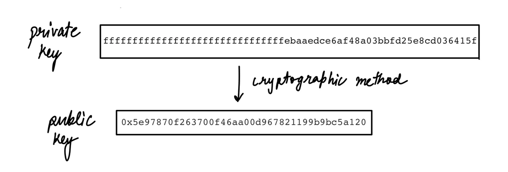
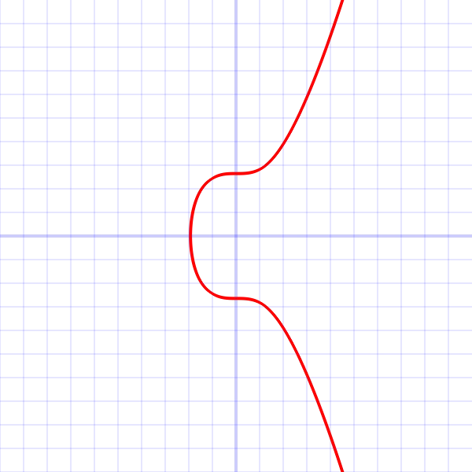
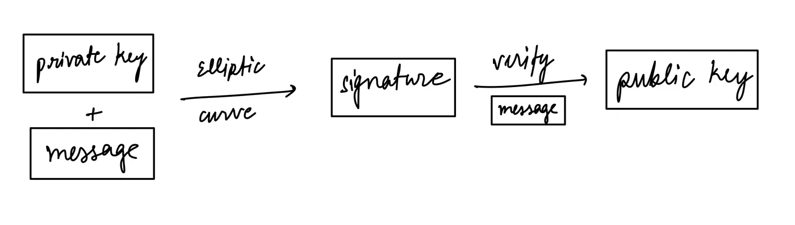
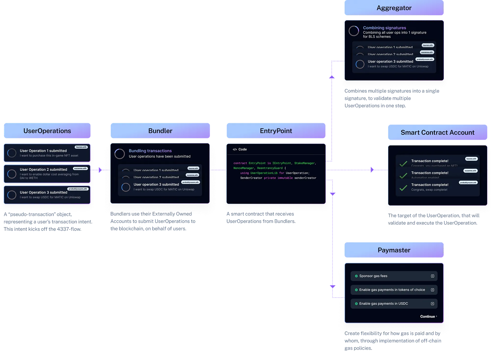

## A Precompile for secp256r1 Curve Support

If you see the original proposal [RIP-7212 (formerly EIP-7212)](https://eips.ethereum.org/EIPS/eip-7212), it says,

> This proposal creates a precompiled contract that performs signature verifications in the “secp256r1” elliptic curve by given parameters of message hash, `r` and `s` components of the signature, `x` and `y` coordinates of the public key. So that, any EVM chain - principally Ethereum rollups - will be able to integrate this precompiled contract easily.

after reading this, if you are like me, you would say, “What the heck is this?”. This needs a lot of foundation to understand the whole scope of problems it solves and the innovation that can be built on top of that.

First up is Externally owned accounts.

### Externally owned accounts

Externally owned accounts are accounts controlled by anyone with private keys. The basic idea is to create a pair of cryptographic keypairs, one public, and one private key. It can be done using a regular Diffie Hellman algorithm (the discrete logarithm method), which seems much more straightforward than the Elliptic curve digital signature method. So why an elliptic curve?

## Elliptic Curves

Elliptic curves are more computationally efficient and use shorter keys, which saves transaction fees compared to other algorithms at work. Let’s understand it a little.

This might look very complex on the surface level, but mathematically, it’s easy. If you want to explore this further, you can read this: [https://www.math.brown.edu/johsilve/Presentations/WyomingEllipticCurve.pdf](https://www.math.brown.edu/johsilve/Presentations/WyomingEllipticCurve.pdf), as I will not dive deep into this.

In simple terms, the curve below is used to get random points on the curve by creating and reflecting lines. Those points can be used to develop keypairs.



The elliptic curve is defined by following mathematical equation,


by varying a and b, we can have multiple equations and their pair curves.

### secp256k1 vs secp256r1

In mathematics, the two most common elliptic curves defined in [SEC 2](https://www.secg.org/sec2-v2.pdf) are **secp256k1** and **secp256r1.** Note the “r” in the penultimate position rather than a “k.” The “k” in secp256k1 stands for **Koblitz,** and the “r” in secp256r1 stands for **random**.

For secp256k1, we have

```
a = 0
b = 7
```

and for secp256r1 (also called NIST P-256), we have

```
a = FFFFFFFF 00000001 00000000 00000000 00000000 FFFFFFFF FFFFFFFF FFFFFFFC
b = 5AC635D8 AA3A93E7 B3EBBD55 769886BC 651D06B0 CC53B0F6 3BCE3C3E 27D2604B
```

Random seems more secure, but the fun fact is that Bitcoin started with secp256k1, aka the Koblitz curve. The reason comes from the conspiracy of the NSA controlling NIST, who might have created a backdoor using the random number generator in secp256r1 for a & b. Given the fact that the curve r1 is pseudo-randomized, thus such weak curves could be used under the attack. As a result, Satoshi decided to use a pre-defined pure Koblitz curve for Bitcoin. Not to mention, the Koblitz curve is more efficient, comparatively.



Now, using the secp256k1 elliptic curve, a user can create a signature for a transaction using a private key, which anyone can use to verify if a particular transaction was signed by a public address or not. To understand this practically, there is this fantastic website that you can use: [https://andersbrownworth.com/blockchain/public-privatfantasticys/signatures.](https://andersbrownworth.com/blockchain/public-private-keys/signatures.)

### Why even care about secp256r1?

Curious? Why is there so much effort in using secp256r1? Even when both curves have almost the exact cost of combined attacks and security conditions. One of the most essential functions is that this curve is widely used and supported in many modern devices, such as Apple’s Secure Enclave, Webauthn, and Android Keychain, which improves user adoption. It solves the challenge web3 currently faces, “cumbersome user experience (UX).”


For example, the [Apple secure enclave](https://developer.apple.com/documentation/security/certificate_key_and_trust_services/keys/protecting_keys_with_the_secure_enclave) only works with secp256r1 as it is a hardware-based key manager isolated from the main processor, meaning you can’t change how the signature is produced but can verify it. And if the protocol is just using secp256k1, we can’t have FaceID-integrated web3 mobile applications.

We need to know more about account abstraction to know what RIP-7212 brings to the table.

## EIP-4337: Account abstraction

The idea was first tossed in 2017 with the proposal of EIP-86 by Vitalik Butrin. However, the notion of account abstraction existed only with the proposal of EIP-4337, as it avoided making changes to the consensus-layer protocol.

Instead of changing the bottom-layer transaction type and adding new protocol features, this proposal introduced a higher-layer pseudo-transaction object called a `UserOperation`. Users send `UserOperation` into a separate mempool using a bundler to set the objects into a transaction while making a `handleOps` call to a special contract, and that transaction then gets included in a block using an `entrypoint`.

The key goal achieved was to allow users to use smart contract wallets containing arbitrary verification logic instead of EOAs as their primary account.



Users can now send `UserOperation`, which contains all the same parameters as the transaction, like “sender,” “to,” “calldata,” “maxFeePerGas,” “nonce,” “maxPriorityFee,” and “signature.” Apart from this, it also has the `Signatature` field is not defined by the protocol but by each account implementation.

This means you can use any signature algorithm adhering to your needs for the application from secp256r1 to Ed25519. Lost? Why is there a need for RIP-7212? What else must be done if EIP-4337 created the support to use secp256r1?

### Precompiled Contracts

Higher gas cost. Unfortunately, using a non-native Ethereum curve generates a higher computational cost (gas). Compared to the native curve, it is around 50 times more. Because precompiled contracts support the native curve. What are precompiled contracts?

Precompiled contracts are special kinds of contracts bundled with the EVM at a fixed address and can be called with a determined gas cost, which is far lower than calling non-precompiled smart contracts.

[0x01](https://www.evm.codes/precompiled#0x01?fork=cancun) is the `ECRECOVER` precompiled address is a function to get the public address from a signature for the secp256k1 curve. RIP-7212 proposes a new precomplied contract for secp256r1, `P256VERIFY` , similar in function to the prior but for the secp256r1 curve.

In summary,

> RIP-7217 proposes to create a precompiled contract for the secp256r1 curve.

Hopefully, you might get the picture that I wanted to paint in your mind.

_Bonus. Still don’t know the reason for it being RIP, not EIP?_ So, other willing rollups can use this to complete implementation around the standardization created with [RIP](https://ethereum-magicians.org/t/eip-7212-precompiled-for-secp256r1-curve-support/14789/69).

### Resources:

::link{url="https://eips.ethereum.org/EIPS/eip-7212"}
::link{url="https://ethereum-magicians.org/t/eip-7212-precompiled-for-secp256r1-curve-support/14789"}
::link{url="https://www.johndcook.com/blog/2018/08/21/a-tale-of-two-elliptic-curves/"}
::link{url="https://eips.ethereum.org/EIPS/eip-4337"}
::link{url="https://eprint.iacr.org/2023/939.pdf"}
::link{url="https://developer.apple.com/documentation/security/certificate_key_and_trust_services/keys/protecting_keys_with_the_secure_enclave"}
::link{url="https://www.odaily.news/en/post/5188615"}
::link{url="https://dappworks.com/why-did-satoshi-decide-to-use-secp256k1-instead-of-secp256r1/"}
